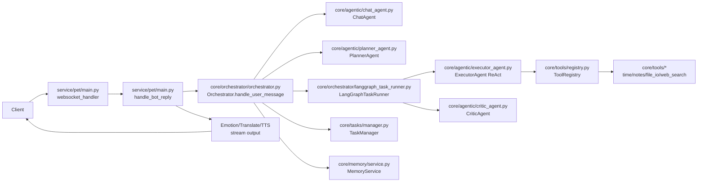
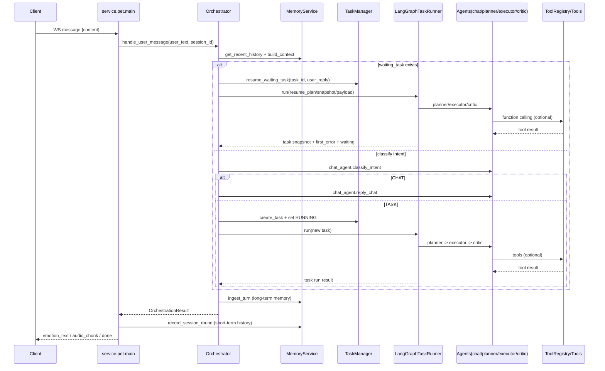
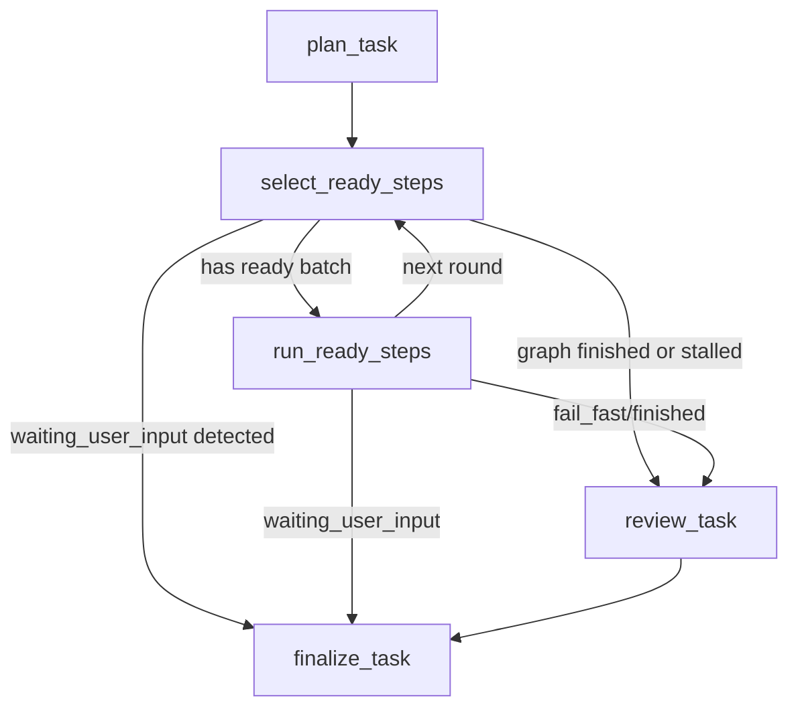
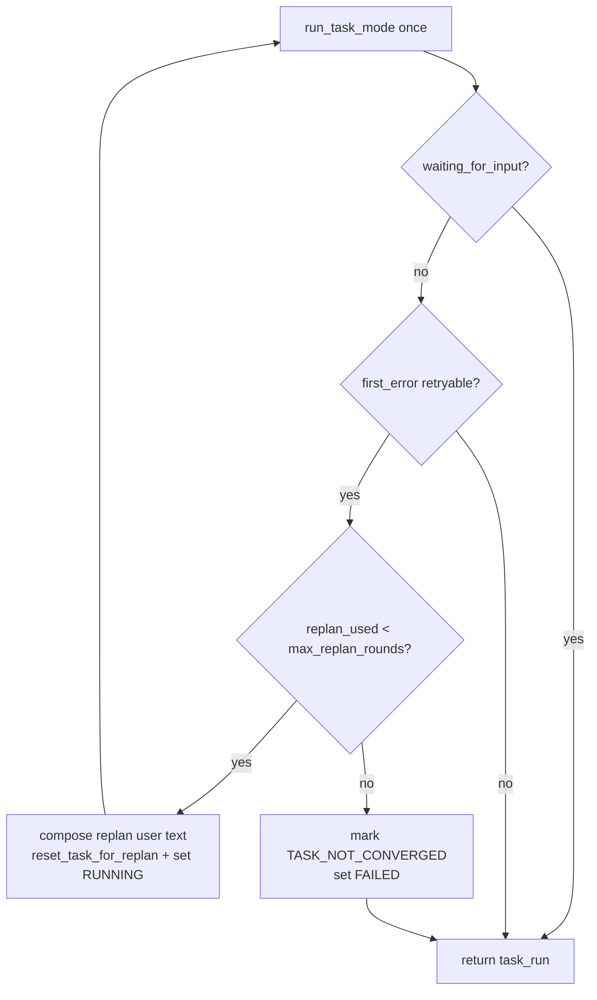

# Orchestrator 编排系统架构图

本文档聚焦 `service -> orchestrator -> agent/task/tool/memory` 的编排链路，帮助快速理解“用户输入后，系统如何持续推进直到收敛或可恢复退出”。

## 1. 总览组件图

## 2. 单轮请求时序图

## 3. Task 模式内部 DAG 调度图

步骤级状态（节点 state）：
- `pending -> ready -> running -> succeeded`
- 异常分支：`failed / blocked`
- 缺信息分支：`waiting_user_input`（等待用户补充后恢复同一 `task_id`）

## 4. 收敛循环（Orchestrator 层）

说明：
- 该循环是“有界持续推进”，不是无限自旋。
- 另外还有 `max_clarify_rounds`：waiting 追问轮次超限会转 `TASK_NOT_CONVERGED`。

## 5. 代码映射（快速定位）

| 职责 | 关键入口 |
|---|---|
| WS 接入与回合处理 | `service/pet/main.py` -> `websocket_handler` / `handle_bot_reply` |
| 编排主入口 | `core/orchestrator/orchestrator.py` -> `handle_user_message` |
| 任务图调度 | `core/orchestrator/langgraph_task_runner.py` -> `run` |
| 状态持久化与快捷指令 | `core/tasks/manager.py` |
| 工具调用协议 | `core/tools/base.py` / `core/tools/registry.py` |
| 记忆上下文与沉淀 | `core/memory/service.py` |
